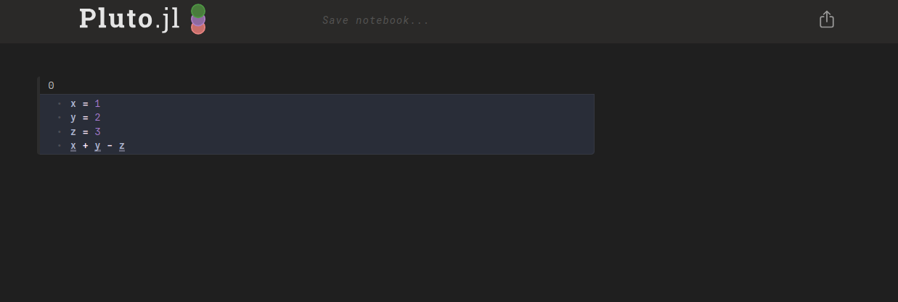

# MultilinePluto.jl

This package simply loads and re-exports [Pluto.jl](https://github.com/fonsp/Pluto.jl),
but performs piracy on its `parse_custom` function during loading so that code-cells
containing multiple lines of code do not need to be wrapped in a `begin`/`end` block.

```julia
julia> using MultilinePluto

julia> Pluto.run()
```


